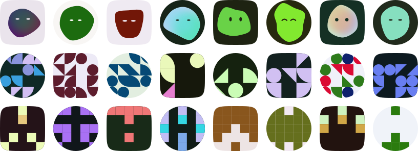

# Morphatar

[](https://www.npmjs.com/package/@morphatar/core)
[](https://www.npmjs.com/package/@morphatar/react)
[](https://bundlephobia.com/package/@morphatar/core)

[](https://github.com/saranshhardaha/morphatar/actions/workflows/ci.yml)
[](LICENSE)

Zero-dependency, deterministic algorithmic avatar generator.

<p align="center">
  <a href="https://morphatar.vercel.app"></a>
</p>

One seed in, the same SVG out — on every machine, in every runtime, forever.
No `Math.random()`, no canvas, no network, no images to host.

```
~4.2 KB min+gzip · 0 runtime dependencies · 3 shape variants · 6 expressions
```

## Try it

- **[Playground](https://morphatar.vercel.app)** — every option, live.
- **StackBlitz** — [React](https://stackblitz.com/github/saranshhardaha/morphatar/tree/master/examples/react) · [vanilla JS](https://stackblitz.com/github/saranshhardaha/morphatar/tree/master/examples/vanilla)
- **No install at all** — straight from a CDN:

```html
<div id="avatar"></div>
<script type="module">
  import { morphatar } from 'https://cdn.jsdelivr.net/npm/@morphatar/core/+esm';
  document.getElementById('avatar').innerHTML = morphatar({ seed: 'grace-hopper', size: 96 });
</script>
```

- **Not even JavaScript** — an `` pointed at the [hosted endpoint](#hosted-endpoint):

```html

```

## Packages

| Package | What it is |
| --- | --- |
| [`@morphatar/core`](packages/core#readme) | Pure TypeScript engine. Takes options, returns a raw `<svg>` string. |
| [`@morphatar/react`](packages/react#readme) | ~40-line React wrapper around the core, memoised with `useMemo`. |
| `apps/web` | Next.js 16 playground, plus the hosted `/api/avatar` endpoint. |
| `examples/` | Standalone Vite apps (React, vanilla) behind the StackBlitz links. |

## Install

```bash
pnpm add @morphatar/react   # React
pnpm add @morphatar/core    # anything else
```

## Usage

```tsx
import { Morphatar } from '@morphatar/react';

<Morphatar seed="ada@lovelace.dev" variant="organic" size={64} />;
```

```ts
import { morphatar, morphatarDataUri } from '@morphatar/core';

const svg = morphatar({ seed: 'ada@lovelace.dev', variant: 'geometric' });
const uri = morphatarDataUri({ seed: 'ada@lovelace.dev' }); // for 
```

The core is framework-agnostic and side-effect free, so it runs the same in a
React Server Component, an edge function, a CLI or a `<script>` tag.

### Any framework

The core returns a string, so every framework is one line of "render this
HTML". The output is safe to inject: caller-supplied values are escaped and the
seed never reaches the markup.

**Vue**

```vue
<script setup lang="ts">
import { computed } from 'vue';
import { morphatar } from '@morphatar/core';

const props = defineProps<{ seed: string }>();
const svg = computed(() => morphatar({ seed: props.seed, size: 40 }));
</script>

<template>
  <span v-html="svg" />
</template>
```

**Svelte 5**

```svelte
<script lang="ts">
  import { morphatar } from '@morphatar/core';

  let { seed }: { seed: string } = $props();
</script>

{@html morphatar({ seed, size: 40 })}
```

**Solid**

```tsx
import { morphatar } from '@morphatar/core';

export function Avatar(props: { seed: string }) {
  return <span innerHTML={morphatar({ seed: props.seed, size: 40 })} />;
}
```

**Astro** — rendered at build or request time, zero client JavaScript:

```astro
---
import { morphatar } from '@morphatar/core';
const { seed } = Astro.props;
---
<Fragment set:html={morphatar({ seed, size: 40 })} />
```

## Hosted endpoint

`https://morphatar.vercel.app/api/avatar` renders an avatar from query
parameters, for places that cannot install a package: Markdown, a CMS field, a
no-build prototype.

```md

```

| Parameter | Values | Default |
| --- | --- | --- |
| `seed` | any string, up to 256 characters | — (required) |
| `variant` | `organic`, `geometric`, `pixel` | `organic` |
| `mask` | `circle`, `squircle`, `hexagon`, `none` | `squircle` |
| `complexity` | integer `1`–`10` | `5` |
| `multicolor` | `true`, `false` | `false` |
| `animation` | `none`, `blink`, `dart` | `none` |
| `background` | CSS colour; bare hex like `09090b` is accepted | per variant |
| `colors` | comma-separated CSS colours, up to 8 | from seed |
| `size` | integer px, `16`–`1024` | `256` |
| `title` | accessible name, up to 128 characters | `Avatar` |

Invalid values return `400` with a plain-text reason. Responses are
`image/svg+xml`, CORS-enabled and CDN-cached. For production traffic, serve
avatars from your own app — the core is one import, see
[the route handler recipe](packages/core#served-from-your-own-endpoint).

## Recipes

**Fallback for users without a photo**

```tsx

```

**Swap in when a remote photo fails to load**

```ts
img.addEventListener('error', () => {
  img.src = morphatarDataUri({ seed: user.id, size: 40 });
}, { once: true });
```

**CSS background**

```ts
el.style.backgroundImage = `url("${morphatarDataUri({ seed: user.id })}")`;
```

**Theme the UI around an avatar** — resolve a seed's colours without rendering:

```ts
const { background, foreground } = morphatarPalette({ seed: user.id });
card.style.setProperty('--accent', foreground[0]);
```

## How it compares

| | Morphatar | boring-avatars | DiceBear (core + identicon) | jdenticon | minidenticons |
| --- | --- | --- | --- | --- | --- |
| Min + gzip | 4.2 KB | 2.8 KB | 4.2 KB | 2.8 KB | 0.5 KB |
| Runtime dependencies | 0 | 0 | 1 | 1 | 0 |
| Frameworks | any | React only | any | any | any |
| Output | SVG string | React element | SVG string | SVG string or canvas | SVG string |

Sizes are each library's main render call bundled with esbuild (minified, React
external), measured September 2026 against boring-avatars 2.0.4, DiceBear 9.4,
jdenticon 3.3.0 and minidenticons 4.2.1.

What Morphatar adds on top of a deterministic SVG:

- **Characters, not just patterns** — organic blobs get one of six expressions,
  with optional `blink` and `dart` eye motion.
- **A contrast guarantee** — generated foregrounds clear WCAG AA 4.5:1 against
  the background, including one you pass in.
- **SSR without surprises** — byte-identical server and client output, and
  content-derived ids so many avatars share a page without clip-path collisions.
- **Stable colours** — changing `variant` or `complexity` keeps a seed's palette.

## API

```ts
interface MorphatarProps {
  seed: string;                                       // the deterministic seed
  variant?: 'organic' | 'geometric' | 'pixel';        // default: 'organic'
  colors?: string[];                                  // hex / rgb() / hsl()
  background?: string;                                // default: per variant
  mask?: 'circle' | 'squircle' | 'hexagon' | 'none';  // default: 'squircle'
  complexity?: number;                                // 1–10, default: 5
  multicolor?: boolean;                               // default: false
  animation?: 'none' | 'blink' | 'dart';              // organic only, default: 'none'
  size?: number | string;                             // default: '100%'
  title?: string;                                     // aria-label, default: 'Avatar'
}
```

`<Morphatar>` also forwards any `<span>` attribute (`className`, `style`,
`onClick`, …) to the wrapper element.

Extra exports from `@morphatar/core`: `morphatarPalette()` (resolve a seed's
colors without rendering), plus the building blocks — `fnv1a`, `sfc32`,
`createRandom`, `createPalette`, `contrastRatio`, `renderEyes`, `EXPRESSIONS`,
`maskShape`, and the three generators `renderOrganic`, `renderGeometric` and
`renderPixel`, each taking a `RenderContext` and returning a `Drawing`
(`{ defs, layers }`).

### Background

Organic renders on **transparency** by default — it is a floating blob, so it
drops onto whatever is behind it. Geometric and pixel still paint a background,
because their empty cells are negative space rather than absence; an identicon
without one is a scatter of loose squares.

```tsx
<Morphatar seed="ada" />                             // transparent blob
<Morphatar seed="ada" background="#09090b" />        // painted
<Morphatar seed="ada" variant="pixel" background="transparent" />  // force it off
```

`background` accepts any CSS colour, and `'transparent'` / `'none'` / `''` all
mean "paint nothing" on any variant. Whatever you pass also becomes the
palette's **contrast anchor**: generated foregrounds are re-derived to clear
4.5:1 against *it*, and the eyes are painted in it. Adding a background never
reshuffles the geometry — the generated tone is still drawn from the PRNG
stream even when you override it.

Two consequences of transparency worth knowing:

- **The mask stops showing for organic.** The blob floats with a margin, so
  `circle` / `squircle` / `hexagon` have nothing to clip until a background is
  painted. The blob's own outline is the silhouette.
- **The contrast guarantee is against the anchor, not your page.** With no
  background the library cannot know what is behind the avatar, so a dark blob
  can land on a dark page. Pass `background` — or pass your page's colour as the
  anchor — when legibility against a specific surface matters.

### Colour modes

Avatars are **single-colour by default**: one foreground for the whole shape.
Every entry in `colors` is a shape colour — the background is set only by
`background`, never taken out of the palette.
`multicolor` opts into the full palette, and each variant blends it differently:

| Variant | `multicolor: false` | `multicolor: true` |
| --- | --- | --- |
| organic | one flat foreground | a soft colour field: blurred spots over a base fill, clipped to the blob |
| geometric | every cell shares one colour | each cell picks its own |
| pixel | every pixel shares one colour | each pixel picks its own |

The organic blob is always **one** closed path, never a stack — overlapping
shapes read as mud at avatar sizes, so multiple colours are merged into the fill
rather than split across layers.

The multicolor field is a mesh-gradient, not a linear one: the most legible
foreground fills the blob, the remaining colours float over it as heavily
blurred ellipses at partial opacity, and the whole group is clipped back to the
blob path. The blur is what makes the blend soft — no seam, no directional axis
— and the clip is what stops it bleeding a fuzzy halo past the outline. Spots
tint rather than replace, so a palette that mixes a near-black with a near-white
still blends instead of blotting.

### Notes

- **The seed never reaches the markup.** `aria-label` defaults to the literal
  string `"Avatar"`, because seeds are usually emails or user ids. Pass `title`
  when you want a real accessible name.
- **Ids are content-derived**, so two avatars on one page never collide and
  server and client render byte-identical markup.
- **Caller-supplied colours are escaped** before they reach an attribute value,
  so a hostile `colors` entry or `background` cannot break out of the markup.
- **Motion respects `prefers-reduced-motion`** — animated variants disable
  themselves automatically.

## How it works

1. **Hash** — FNV-1a folds the seed string into one 32-bit integer.
2. **Expand** — splitmix32 stretches that integer into 128 bits of sfc32 state.
   sfc32 is a small, fast counting PRNG; the same seed always yields the same
   stream of floats.
3. **Colour** — the palette is drawn *first*, from the seed alone. That is why
   switching `variant` or nudging `complexity` restyles the geometry without
   changing an avatar's colors. Generated foregrounds target distinct lightness
   levels and are pushed until each clears **4.5:1** against the contrast
   anchor — the `background` you passed, or a derived tone.
4. **Draw** — the same stream feeds one of three generators:
   - **organic** — a single blob: 5–10 anchor points laid out in polar
     coordinates, radii pushed and pulled by the PRNG, joined with a *closed*
     Catmull–Rom spline emitted as cubic beziers. Closing the spline is what
     removes every hard edge — the curve is C1-continuous across the seam too.
     Complexity is the anchor count, so the shape goes from near-circular at 1
     to lobed at 10. Every blob gets a pair of eyes, drawn from the same stream:
     `dot`, `wide`, `oval`, `sleepy`, `happy` or `wink`. They are painted in the
     *background* colour, which reads as punched-out holes and inherits the
     palette's contrast guarantee for free.
   - **geometric** — a 3×3 or 4×4 Bauhaus grid; each cell becomes a disc, a
     quarter disc, a triangle or empty space, snapped to a right-angle rotation.
   - **pixel** — a 5×5 identicon where only the left three columns are generated
     and the remainder is mirrored.
5. **Assemble** — shapes, background, `<clipPath>` mask and scoped keyframes are
   concatenated into a single `<svg>` string.

## Development

```bash
pnpm install
pnpm build          # build core + react
pnpm test           # determinism, contrast and markup tests (node:test, no deps)
pnpm size           # enforce the 8 KB gzipped budget for @morphatar/core
pnpm dev            # run the Next.js playground
pnpm typecheck      # every workspace
pnpm hero           # regenerate apps/web/public/hero.svg after output changes
```

The test suite is the contract: it pins the FNV-1a reference vectors, asserts
byte-identical output across renders, verifies the pixel grid really is
mirrored, checks that organic draws exactly one blob and one pair of eyes,
that single-colour mode never leaks a second colour, that a custom palette is
never escaped and a hostile one never breaks out of an attribute, that adding a
background does not reshuffle the geometry, and sweeps 300 seeds for the
contrast floor.

## Licence

MIT.
